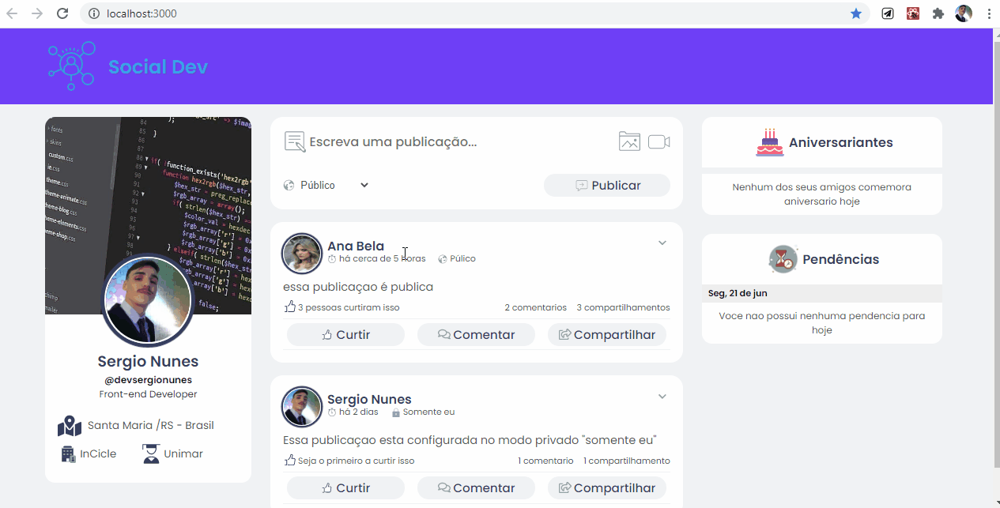

# Social Dev

  </img>
  
Versão Desktop

  </img>
  
Versão Mobile

# Informaçoes:

## Funcionalidades:

- Like nas publicações
- Posta uma nova publicação
- Carrega os dados da api fake do mirage.js
- Dados como datas entre outros, devidamente formatodos.

## Tecnologias:

### React:

- Biblioteca utilizada para a criação da interfaçe.

### styled-Components:

- Toda parte de estilo da aplicação vem dessa incrivel biblioteca de css-in-js.
- Metodologia de estilizações globais usando variaveis css e unidade de medida REM.

### Miragejs:

- Integração com essa Fake Api para realiza requisiçoes http sem back-end.
- Post e Get realizado apartir de sua funcionalidade de interceptação de rotas.

### Axios:

- Biblioteca usada nas requisições http.
- Escolhida por conta da sua funcionalidade de criar uma url padrão, que seria baseURL e pela sua faciliade de manipula dados.

## Style:

<pre>
  variaveis css:
    --blue: #6f3ff7;
    --text-title: #363f5f;
    --title-primery: #39a6ef;
    --shape: #fff;
    --text-body: #555;
    --background: #f0f2f5;
</pre>

## Links:

- <a href='https://github.com/facebook/react'>React</a>
- <a href='https://github.com/styled-components/styled-components'>Styled-Components</a>
- <a href='https://miragejs.com/'>Miragejs</a>
- <a href='https://axios-http.com/docs/intro'>Axios</a>

## Usar a template:

clone o projeto:

<pre>
  git clone https://github.com/devsergionunes/social-dev.git
</pre>

Iniciar aplicação:

<pre>
// instala as dependencias
 npm install 

 // executar a aplicação com webpack-dev-server
  npm start
</pre>
